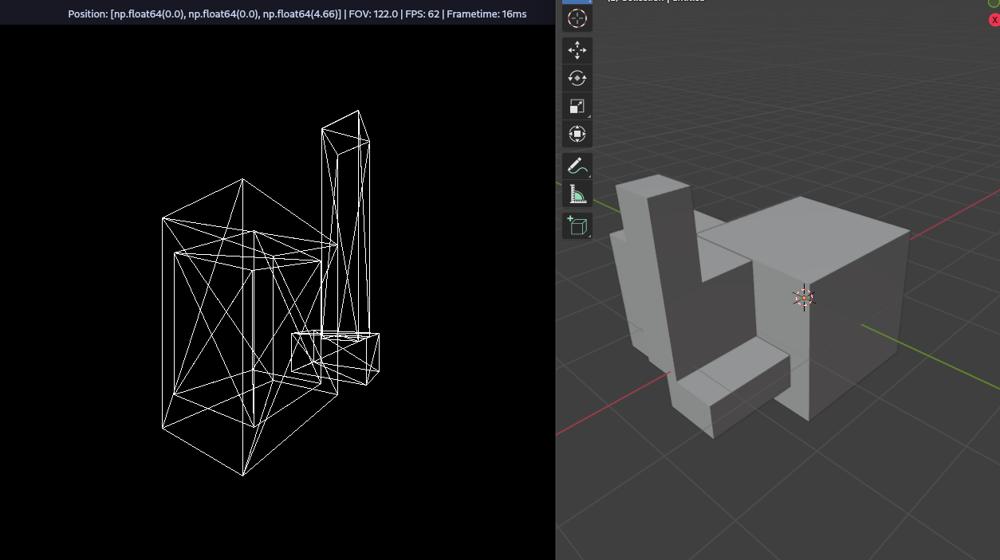

# 3D Engine

Little 3D engine I made using pygame and my limited knowledge of 3D rendering. It can render STL files and transform loaded models dynamically.
On my machine, it can handle around 200 triangles (or 600 edges) at 60 fps. (As this is pure python and pygame, it does not use the GPU).

Right: 3D object in Blender; Left: the same object rendered by the engine!

### Structure

- `main.py`: entry point, event loop, keybinds
- `viewport.py`: 3D projection onto screen space (core logic)
- `structures.py`: world data structures
- `renderer.py`: blit dispatcher
- `stl.py`: stl parser

### References

- https://stackoverflow.com/questions/8530505/how-should-i-handle-projection-of-3d-points-clipped-to-the-viewing-plane
- https://en.wikipedia.org/wiki/Clipping_(computer_graphics)
- https://math.stackexchange.com/questions/305642/how-to-find-surface-normal-of-a-triangle
- https://en.wikipedia.org/wiki/Cohen%E2%80%93Sutherland_algorithm
- https://en.wikipedia.org/wiki/Line_clipping
